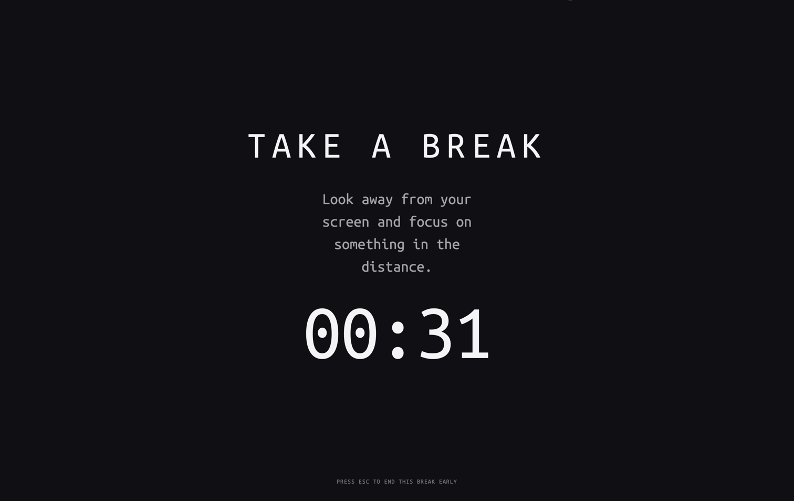
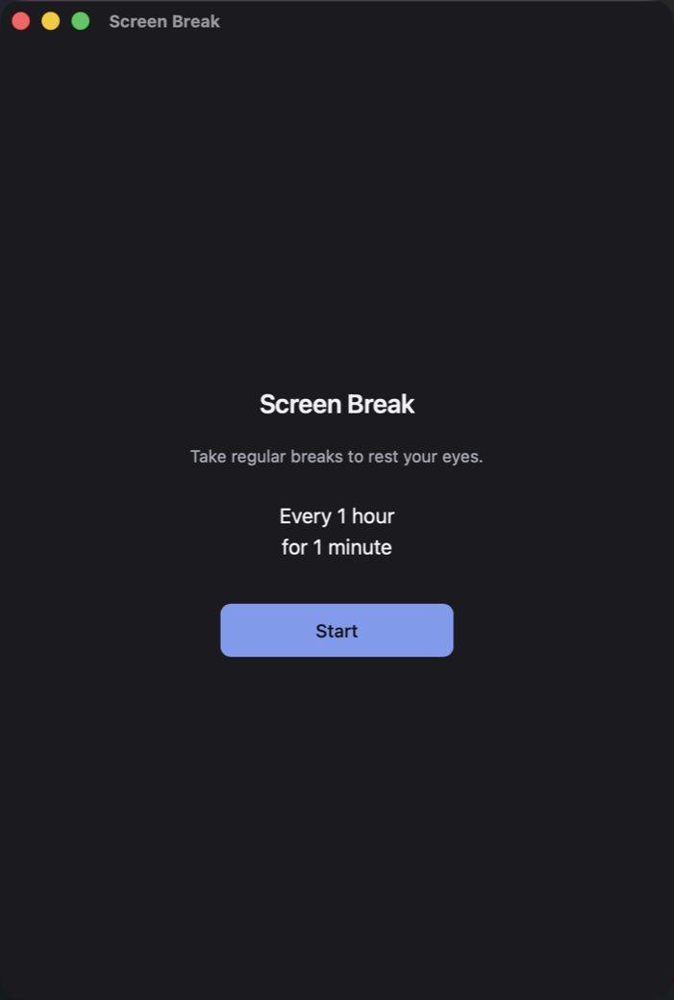
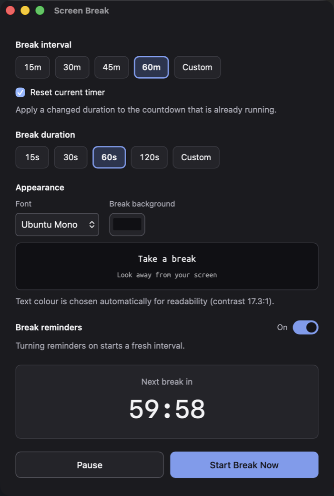
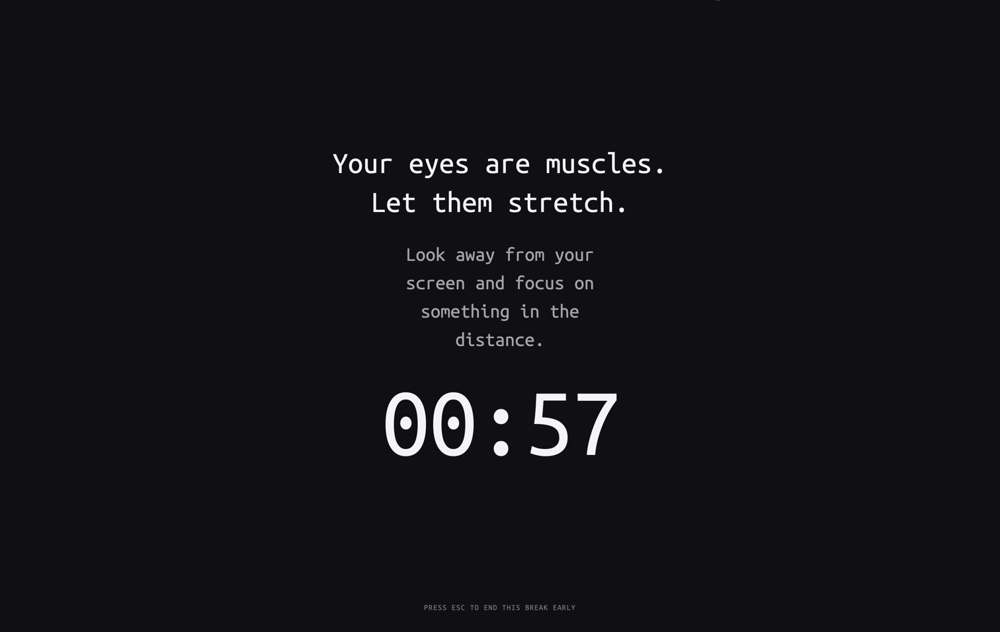

# Screen Break

A small desktop app that interrupts you every so often with a fullscreen
reminder to look away from your screen and focus on something in the distance.

That is the whole idea. It is not a productivity tracker, it has no account, it
collects nothing, and it never talks to the internet. Your settings are a JSON
file on your own machine.

<p align="center">
  
</p>

```
Work normally  →  wait your interval  →  fullscreen break  →  back to work  →  repeat
```

---

## Installing

Screen Break runs on macOS, Windows and Linux.

There are **no published releases yet**, so for now you build it yourself — see
[docs/development.md](docs/development.md). Once releases exist, installing will
look like this:

| Platform | What you download | How to install |
|---|---|---|
| macOS | `.dmg` | Open it and drag **Screen Break** to Applications |
| Windows | `.msi` or `.exe` | Run the installer |
| Linux | `.deb`, `.rpm` or `.AppImage` | Install the package, or mark the AppImage executable and run it |

> **A note on the first launch.** The builds are currently **unsigned**, so
> macOS will say the app "cannot be opened because it is from an unidentified
> developer" and Windows SmartScreen will warn you. On macOS, right-click the
> app and choose **Open** the first time. Removing those warnings needs paid
> certificates; the details are in
> [docs/distribution.md](docs/distribution.md).

---

## Using it

### First launch

You get one screen, with the default schedule and a single button. No signup,
no tutorial, no permission prompts.

<p align="center">
  
</p>

Press **Start** and it begins counting down. That is the entire setup.

### Everyday use

Screen Break lives in your **menu bar** (macOS) or **system tray** (Windows and
Linux). Closing the settings window does **not** quit it — the window just
hides and breaks keep coming. Use the tray icon to get back:

```
Open Settings
─────────────
Pause  /  Resume
Start Break Now
─────────────
Quit
```

Only **Pause** or **Resume** is shown, never both, so the menu always tells you
which state you are in. **Quit** is the only way to actually stop the app.

### When a break appears

The break covers your screen and counts down. There is deliberately no Skip
button — the point is the habit.

If you genuinely need to get out, **press `Esc`**. The break closes immediately
and a fresh interval starts, so it will not pop straight back up. The hint is
printed at the bottom of the break screen.

### Settings

<p align="center">
  
</p>

| Setting | Choices | Default |
|---|---|---|
| **Break interval** | 15m / 30m / 45m / 60m, or anything from 1 minute to 24 hours | 60 minutes |
| **Break duration** | 15s / 30s / 60s / 120s, or anything from 5 seconds to 1 hour | 60 seconds |
| **Reset current timer** | on / off | on |
| **Font** | Ubuntu Mono, System, Serif, Monospace | Ubuntu Mono |
| **Break background** | any colour | near-black |
| **Break reminders** | on / off | on |

A few things worth knowing:

- **Custom** opens a small field next to the button. Values outside the allowed
  range are rejected with an explanation rather than silently clamped.
- **Reset current timer**, when on, applies a changed interval to the countdown
  that is *already running*. Turn it off and the new value waits until the next
  interval instead. Either way, changing the font or colour never disturbs a
  running countdown.
- The **break background** accepts any colour, and the text colour is worked
  out from it automatically so it always stays readable.
- **Pause** is temporary and lasts for this session. **Break reminders** off is
  remembered across restarts. Resuming always starts a *fresh* interval — time
  spent paused is not counted, so you never get a break the moment you come
  back.
- **Start Break Now** takes a break immediately, and finishing it resets the
  countdown to the next one.

### Your own quotes

The break screen can show a quote instead of "TAKE A BREAK". Put a plain list
of strings in `quotes.json` next to your settings (paths below):

```json
[
  "Look up. The far wall has been waiting.",
  "Twenty seconds of distance undoes an hour of focus.",
  "Your eyes are muscles. Let them stretch."
]
```

One is picked at random per break.

<p align="center">
  
</p>

The file is re-read at the start of **every** break, so you can edit it and see
the change on the next one without restarting. Leave it as `[]` — the default —
and you get the standard "TAKE A BREAK" screen back.

### Where your settings live

- **macOS** — `~/Library/Application Support/com.screenbreak.app/`
- **Windows** — `%APPDATA%\com.screenbreak.app\`
- **Linux** — `~/.config/com.screenbreak.app/`

Both `settings.json` and `quotes.json` are plain text and safe to edit by hand.
If you break one, the app repairs it field by field on the next launch rather
than crashing or wiping your other settings.

---

## Good to know

- **Breaks appear on your primary monitor only.** Other displays are left alone.
- **Sleeping through breaks is fine.** If your machine was asleep past several
  scheduled breaks, you get **one** break after waking, not a backlog.
- **On macOS the break does not cover the menu bar.** Everything else is
  covered.
- **There are no automatic updates.** You re-download to upgrade.
- **Nothing leaves your machine.** No telemetry, no accounts, no network calls
  of any kind.

---

## Contributing and development

- [docs/development.md](docs/development.md) — running it locally, project
  layout, and the test suite
- [docs/architecture.md](docs/architecture.md) — how it works and why it is
  built this way
- [docs/distribution.md](docs/distribution.md) — packaging, signing and the
  release process

Built with [Tauri 2](https://tauri.app), React and Rust.

## Licence

**No licence has been chosen yet**, which means the code is not yet legally
redistributable. This needs resolving before any public release.

Ubuntu Mono is bundled under the Ubuntu Font Licence 1.0
(`src/assets/fonts/LICENCE.txt`).
